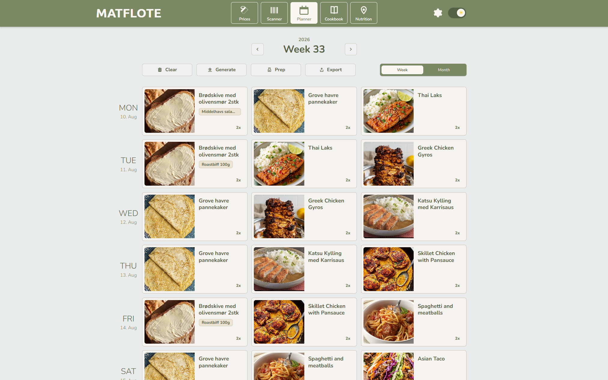
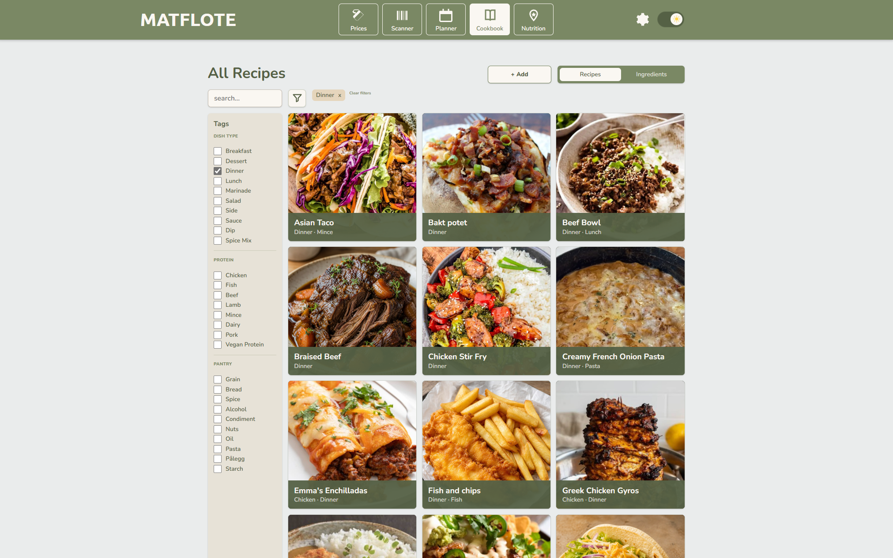
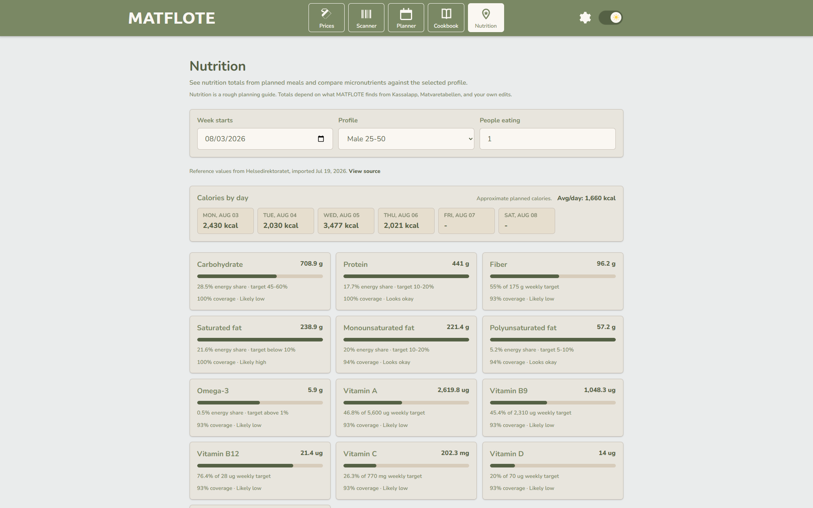
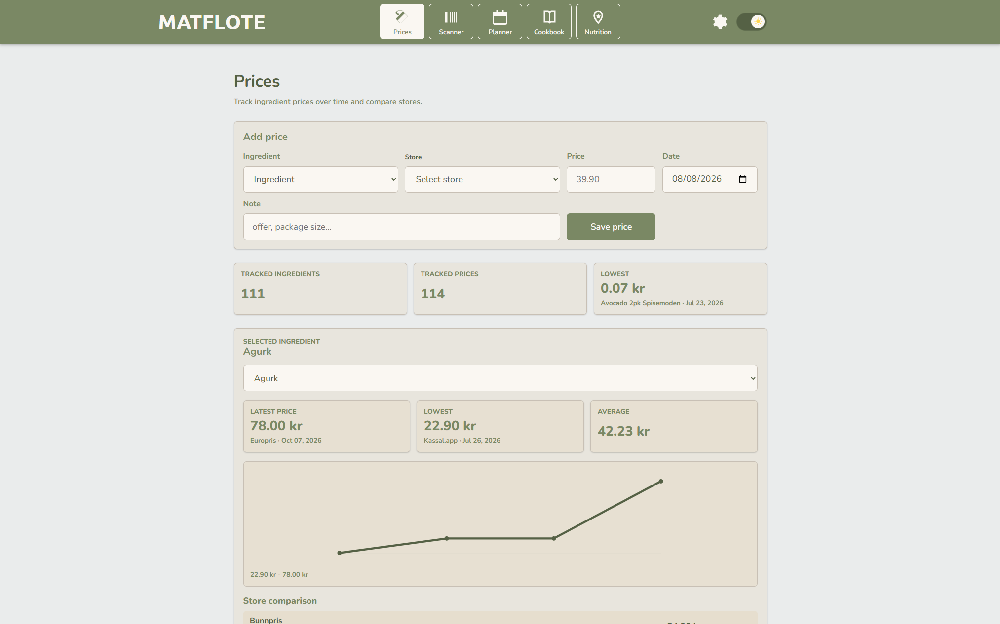
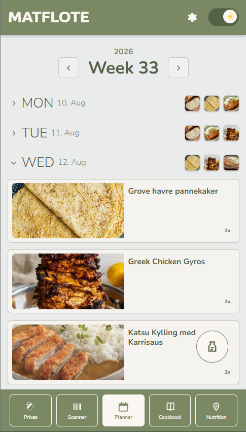
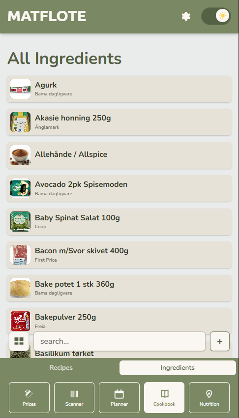

# MATFLOTE

MATFLOTE is a household meal planning and cookbook app. It is my personal tool made to be run on a personal homeserver.

Created with assistance of ChatGPT 5.5.

## Current App Features

- Cookbook with recipes and ingredients.
	- Recipes can contain ingredients and measured recipe components, so one recipe can be used like an ingredient inside another recipe.
	- Recipe ingredients/components store measurable units and preparation, such as chopped, diced, julienned, grated, or crushed.
- Meal planner
	- Prep helper for the current week. It lists produce-style ingredients only when an explicit preparation exists or one can be inferred from recipe instructions.
	- Shopping-list preview and export through the provider-based grocery-list system. Vikunja is the first supported provider.
- Scanner page for Norwegian grocery lookup by barcode/EAN through Kassalapp, with missing nutrition fields supplemented from Matvaretabellen.
- Prices page for local household price tracking by ingredient, store, and date.
- Nutrition page for approximate weekly nutrition summaries from planned meals and locally stored Helsedirektoratet reference values.

## Images

### Planner



### Cookbook



### Nutrition



### Prices



### Mobile 





## Docker

MATFLOTE runs as two containers:

- `frontend`: nginx serves the built frontend and proxies browser requests.
- `backend`: .NET API, SQLite database access, migrations, and image uploads.

Persistent data lives in Docker volumes:

- `matflote-data`: SQLite database at `/data/dinnerplanner.db`
- `matflote-images`: uploaded and seeded images at `/data/images`

## Run

```powershell
docker compose up -d --build
```

Open:

```text
http://localhost:8080
```

To use another host port, create `.env`:

```env
MATFLOTE_PORT=8095
```

Then open:

```text
http://localhost:8095
```

## First Setup Checklist

1. Copy `.env.example` to `.env`.
2. Set `MATFLOTE_PORT` if the default `8080` is already used.
3. Add private keys or tokens for integrations you plan to use:
   - `VIKUNJA_API_TOKEN` for shopping-list export.
   - `KASSALAPP_API_KEY` for product scanning.
   - `HELSEDIREKTORATET_SUBSCRIPTION_KEY` for refreshing nutrition references.
4. Start MATFLOTE.
5. Open Settings and confirm language, integrations, and grocery export mode.
6. Create your first backup after adding real household data.


## Backup And Restore MATFLOTE Data

MATFLOTE household data is made of two parts:

- Database data: ingredients, recipes, tags, tag categories, brands, stores, price points, meal plans, nutrition references/settings, grocery export rules, integration settings, conversion rules, and image metadata.
- Image files: uploaded ingredient/recipe images and seeded placeholder images.

For an app-level portable backup, use:

```text
GET /api/seed-catalog/export-package
```

That downloads a zip containing catalog JSON plus image files. It is the easiest way to move recipes, ingredients, tags, brands, conversion rules, and images between MATFLOTE instances.

Import that package into another MATFLOTE instance:

```powershell
curl.exe -i -X POST `
  -F "file=@C:\path\to\matflote-export-package.zip" `
  "http://localhost:8080/api/seed-catalog/import-package"
```

The import is additive. Matching ingredients and recipes are left alone, so it is useful for seeding or moving curated data, not for replacing a whole household database.

For a complete server backup, back up both Docker volumes.

Create a backup folder first:

```powershell
New-Item -ItemType Directory -Force backups
```

Back up the SQLite volume:

```powershell
docker run --rm -v matflote-data:/data -v ${PWD}/backups:/backup alpine tar czf /backup/matflote-data.tar.gz -C /data .
```

Back up the image volume:

```powershell
docker run --rm -v matflote-images:/images -v ${PWD}/backups:/backup alpine tar czf /backup/matflote-images.tar.gz -C /images .
```

On Linux/macOS, use shell-style current directory paths:

```bash
docker run --rm -v matflote-data:/data -v "$(pwd)/backups:/backup" alpine tar czf /backup/matflote-data.tar.gz -C /data .
docker run --rm -v matflote-images:/images -v "$(pwd)/backups:/backup" alpine tar czf /backup/matflote-images.tar.gz -C /images .
```

## Shopping List Export

MATFLOTE can export generated shopping lists through a provider model. Vikunja is the first supported provider; other todo systems can be added later as separate exporters without changing the grocery-list builder.

Configure Vikunja through environment variables. These values seed first-run/server config, and can later be overridden from the MATFLOTE Settings page:

```env
SHOPPING_LIST_EXPORT_PROVIDER=Vikunja
SHOPPING_LIST_EXPORT_TASK_MODE=SingleTask
VIKUNJA_BASE_URL=https://vikunja.example.com
VIKUNJA_PROJECT_ID=3
VIKUNJA_API_TOKEN=your-token-here
```

The API token must have permission to create tasks in the configured Vikunja project.

The task mode can be changed from the Settings page:

- `SingleTask`: one Vikunja task with a checklist in the description.
- `SeparateTasks`: one Vikunja task per ingredient, formatted with amount, source meals, and brand when available.

Preview the generated list without exporting:

```text
GET /api/grocerylists/preview?from=YYYY-MM-DD&to=YYYY-MM-DD
```

Export the generated list to the configured provider:

```text
POST /api/grocerylists/export?from=YYYY-MM-DD&to=YYYY-MM-DD
```

## Product Scanner

The Scanner page uses Kassalapp through the backend.

For local development, store the key with .NET user-secrets:

```powershell
dotnet user-secrets set "Kassalapp:ApiKey" "your-api-key-here" --project backend
```

For Docker/server use, set the key in your private `.env` or server environment:

```env
KASSALAPP_BASE_URL=https://kassal.app/api/v1
KASSALAPP_API_KEY=your-api-key-here
```

The Settings page can also store or replace the Kassalapp base URL and API key at runtime. Saved Settings values override the environment/appsettings defaults.

Manual EAN lookup and camera barcode scanning both use the same backend endpoint:

```text
GET /api/product-lookup/ean/{ean}
```

Camera scanning uses ZXing in the browser and is loaded only when the scan button is used. Phone browsers normally require MATFLOTE to be opened from a secure origin such as HTTPS before camera access works.

On phone/tablet widths, scanned product results become suggested ingredients. Choose a suggestion, edit the name, brand, image, price, store, tags, or nutrition, then confirm to save it through the normal ingredient API.

## Nutrition References

The Nutrition page compares planned meals against locally stored reference values. MATFLOTE can refresh those reference values from Helsedirektoratet HAPI, but weekly calculations use the local database so the app keeps working without a live external call.

For local development, store the HAPI subscription key with .NET user-secrets:

```powershell
dotnet user-secrets set "Helsedirektoratet:SubscriptionKey" "your-subscription-key-here" --project backend
```

For Docker/server use, set the key in your private `.env` or server environment:

```env
HELSEDIREKTORATET_BASE_URL=https://api.helsedirektoratet.no
HELSEDIREKTORATET_SUBSCRIPTION_KEY=your-subscription-key-here
```

The Settings page can also store or replace the Helsedirektoratet base URL and subscription key at runtime. Saved Settings values override the environment/appsettings defaults.

QA keys from `utvikler-qa.helsedirektoratet.no` must use:

```env
HELSEDIREKTORATET_BASE_URL=https://api-qa.helsedirektoratet.no
```

Refresh local reference values:

```text
POST /api/nutrition/reference-values/import
```


MATFLOTE currently displays weekly reference cards only for nutrients with usable reference data and realistic source coverage: carbohydrates, protein, fiber, saturated fat, monounsaturated fat, polyunsaturated fat, omega-3, and vitamins A, B9, B12, C, D, and E. Calories are shown by day without goal judgement.

Minerals are intentionally not imported or displayed yet. Ingredient nutrition follows Matvaretabellen's explicit fat fields: total fat, saturated fat, trans fat, monounsaturated fat, polyunsaturated fat, omega-3, omega-6, and cholesterol. There is no generic unsaturated fat field. The selected nutrition profile and "people eating" value are stored as household-level backend settings.

## Starter Data Catalog

Starter tags, tag categories, conversion rules, brands, ingredients, and recipes can be shipped through `backend/SeedData/catalog.json`.

On backend startup, after database migrations, MATFLOTE imports that JSON file if it exists. Import is intentionally additive:

- Tag categories, tags, conversion rules, and brands are created when missing.
- Ingredients are matched by ingredient name plus optional brand name.
- Recipes are matched by recipe name.
- Existing matching ingredients and recipes are left alone, so user edits are not overwritten.

This means you can safely keep a starter catalog in the repository while allowing each household instance to evolve independently.

To create starter data through the app:

1. Run MATFLOTE locally.
2. Add ingredients and recipes in the UI.
3. Export the current catalog:

```text
GET /api/seed-catalog/export
```

The endpoint downloads `matflote-seed-catalog.json`. Review it, remove anything personal or experimental, then copy the curated content into `backend/SeedData/catalog.json`.

The catalog uses string enum values for tags, measurement units, preparation, and nutrition fields. Plain JSON export references image URLs but does not contain binary image files. Use the export package endpoint when you need to back up or move images too:

```text
GET /api/seed-catalog/export-package
```

Example JSON shape:

```json
{
  "tagCategories": [
    {
      "name": "Produce",
      "sortOrder": 100,
      "tags": [{ "name": "Vegetable", "sortOrder": 100 }]
    }
  ],
  "conversionRules": [],
  "brands": [],
  "ingredients": [
    {
      "ingredientName": "Carrot",
      "description": "Sweet root vegetable for soups, stews, salads, and sides.",
      "brandName": null,
      "imageUrl": null,
      "price": null,
      "tags": ["Vegetable"],
      "nutritionPer100": null,
      "color": "#f28c28"
    }
  ],
  "recipes": [
    {
      "name": "Carrot sticks",
      "imageUrl": null,
      "description": "Simple crunchy side.",
      "instructions": "Cut carrots into batons.",
      "portions": 1,
      "ingredients": [
        {
          "ingredientName": "Carrot",
          "brandName": null,
          "amount": 140,
          "unit": "Gram",
          "preparation": "Batons"
        }
      ],
      "tags": ["Vegetable"],
      "components": []
    }
  ]
}
```
